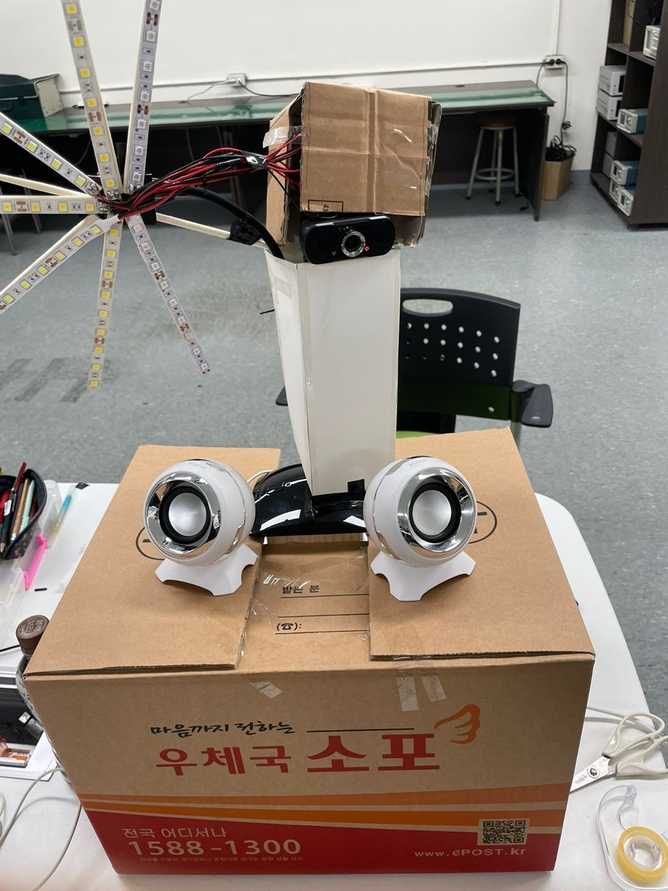
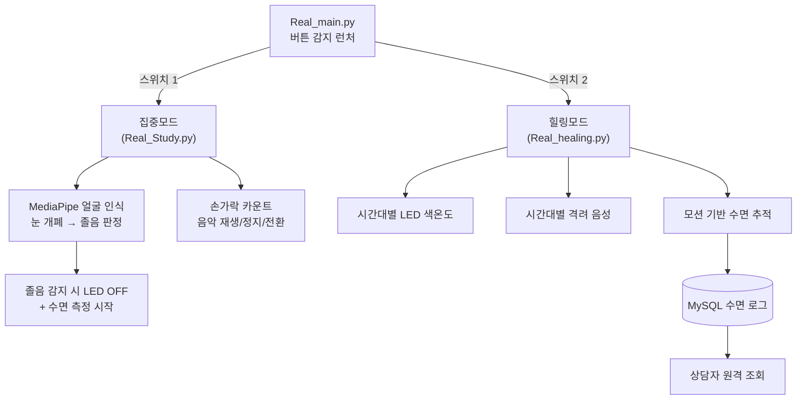
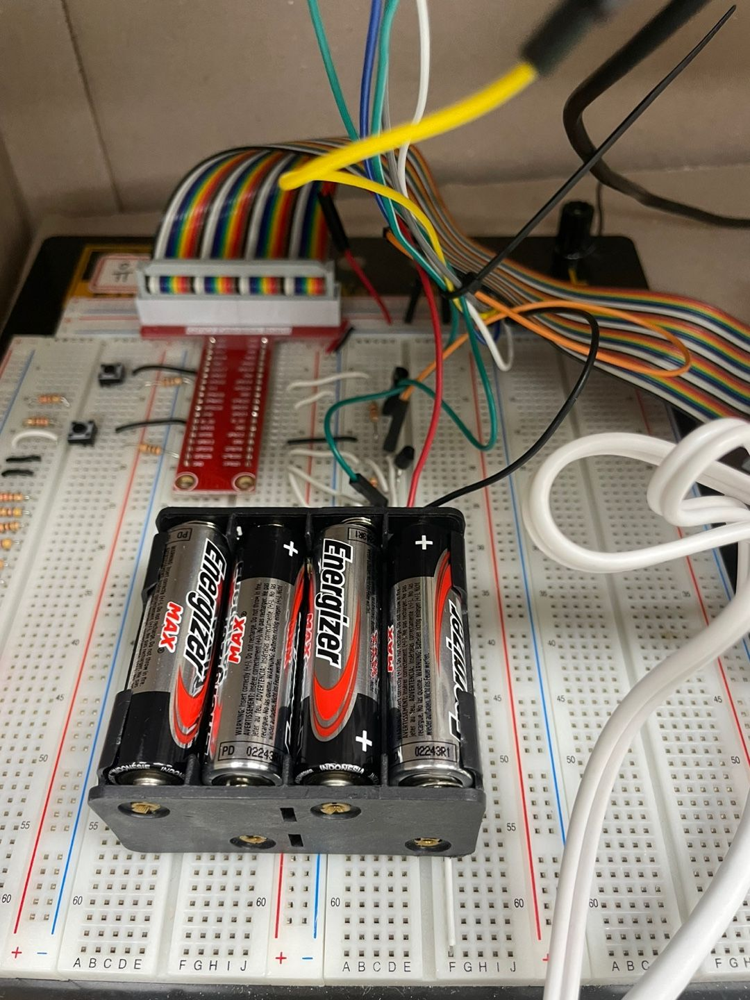
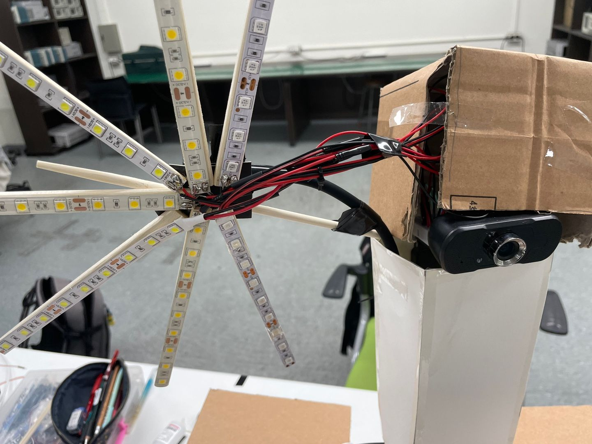

# mindcare# 🌱 1인 가구 마음챙김 (Mind-Care for Single-Person Households)

> **Raspberry Pi + MediaPipe 기반 웰니스 IoT** — 집중/힐링 듀얼 모드로 1인 가구의 정신건강을 케어하는 스마트 조명·사운드 시스템  
> 팀 **solobeam** (3인) · AI융합 로봇S/W


<!-- 시연 영상 썸네일 클릭 시 유튜브로 연결 -->
[](https://youtu.be/YOUR_VIDEO_ID)

---

## 📌 프로젝트 개요

청년 우울증 증가라는 사회적 배경에서 출발한 프로젝트입니다. **조명·수면·사운드**를 통해 1인 가구의 정신건강을 케어하며, 사용자가 버튼으로 **집중모드**와 **힐링모드**를 전환해 사용합니다.

> 💡 배경 근거: 야간 인공조명 노출이 우울증 위험을 높인다는 연구, 우울증에 따른 집중력·기억력 저하 등에 착안 → **시간대별 조명 제어 + 수면 케어 + 사운드**로 대응

---

## 🧩 시스템 구성 (듀얼 모드)

버튼 입력을 감지하는 런처(`Real_main.py`)가 모드별 스크립트를 `subprocess`로 실행/종료하는 구조입니다.



---

## 🛠️ 하드웨어 구성


| 부품 | 사양 | 역할 |
|------|------|------|
| **Raspberry Pi + 브레드보드** | — | 시스템 제어 |
| **USB 카메라** | — | 얼굴/손 인식 |
| **LED strap** | 12V, 3색(흰/파랑/주황) | 시간대별 조명 |
| **PC 스피커** | 2ch USB | 사운드 출력 |
| **서보모터 MG996R ×2** | 4.8~7.2V | 블라인드 각도 제어 |
| **토글 스위치 ×2** | — | 집중/힐링 모드 전환 |

| 내부 회로 | LED 배열 |
|:---:|:---:|
|  |  |

---

## ⚙️ 주요 기능

### 🎯 집중모드 (`Real_Study.py`)
- **졸음 감지**: 얼굴 인식으로 양쪽 눈 개폐를 판정, 5초 이상 감으면 취침으로 인지 → LED OFF + 수면 측정 시작
- **제스처 음악 제어**: 손가락 개수(0~4)에 따라 재생 / 일시정지 / 재개 / 종료 / 플레이리스트 전환
- **음원**: YouTube API로 백색소음·명상음악 재생목록 로드 (`mpv` + `yt-dlp`)

### 🌙 힐링모드 (`Real_healing.py`)
- **시간대별 색온도 조명**: 오전(파랑) / 오후(흰색) / 저녁(주황)으로 서카디안 리듬 반영
- **시간대별 격려 음성**: 아침·점심·저녁 랜덤 재생 (MySQL 음원 DB)
- **수면 추적 → DB**: 모션 감지로 수면 여부 판정, 하루 데이터를 날짜별 MySQL에 저장 → 상담자가 원격 조회
- **태양고도 기반 블라인드**: `ephem`으로 태양 고도를 계산해 서보 각도(PWM) 제어

---

## 🎥 담당 파트: 비전 파이프라인 (MediaPipe)

> 3인 팀 중 **컴퓨터 비전 파트를 담당**했습니다.

**1. 눈 개폐 기반 졸음 판정** — FaceMesh 랜드마크로 눈 높이 / 얼굴 높이 비율을 계산해 OPEN/CLOSE를 분류하고, 얼굴 크기에 무관하게 동작하도록 정규화했습니다.

```python
def isOpen(image, face_mesh_results, face_part, threshold):
    # 눈 영역 높이와 얼굴 전체 높이의 비율로 개폐 판정
    _, eye_height, _   = getSize(image, face_landmarks, EYE_INDEXES)
    _, face_height, _  = getSize(image, face_landmarks, FACE_OVAL)
    return 'OPEN' if (eye_height / face_height) * 90 > threshold else 'CLOSE'
```

**2. 손가락 카운팅 제스처** — 손끝과 관절 landmark의 y좌표를 비교해 펴진 손가락 수를 세고, 손 방향(handedness)에 따라 엄지의 x좌표 판정을 분기했습니다.

```python
def count_fingers(hand_landmarks, handedness):
    finger_tips = [8, 12, 16, 20]
    fingers_open = 0
    for tip in finger_tips:                     # 검지~새끼: 끝이 관절보다 위면 펴짐
        if hand_landmarks.landmark[tip].y < hand_landmarks.landmark[tip - 2].y:
            fingers_open += 1
    # 엄지는 x좌표 + 손 방향으로 별도 판정
    return fingers_open
```

**3. 모션 기반 수면 감지** — 배경 프레임과의 차분(`absdiff`) 후 컨투어 면적으로 움직임 유무를 판단, 부동자세 지속 시 취침으로 인지했습니다.

---

## 🧰 기술 스택

`Python` · `MediaPipe` (FaceMesh / Hands / Holistic) · `OpenCV` · `RPi.GPIO` (PWM) · `MySQL` (pymysql) · `YouTube Data API` · `pygame` · `ephem` · `threading` / `subprocess`

---

## 🎬 시연 영상

[](https://youtu.be/YOUR_VIDEO_ID)

버튼으로 모드를 전환하며 졸음 감지 조명 제어, 제스처 음악 제어, 수면 데이터 DB 저장까지 확인할 수 있습니다.

---

## ⚠️ 실행 전 참고

- 저장소에는 **API 키·DB 비밀번호를 커밋하지 않습니다.** `API_KEY`, `playlist_id`, DB 접속 정보는 별도 설정 파일로 분리하고 `.gitignore` 처리하세요.
- 힐링모드는 태양고도 계산을 위해 관측 위경도(`observer_latitude/longitude`)를 사용합니다.

---

## 📝 트러블슈팅 / 회고

<!-- 비전 파트에서 직접 해결한 문제를 1~2개 구체적으로 적으면 좋습니다. 예: -->
<!--
### 조명 환경에 따른 눈 개폐 오판정
- 문제: 밝기/거리에 따라 임계값이 흔들림
- 해결: 절대 픽셀이 아닌 (눈 높이 / 얼굴 높이) 비율로 정규화
- 배운 점: 카메라 거리·해상도에 강건한 특징 설계
-->

- (작성 예정)
