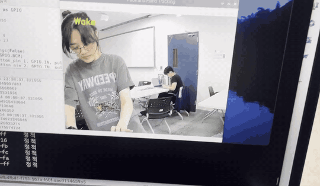
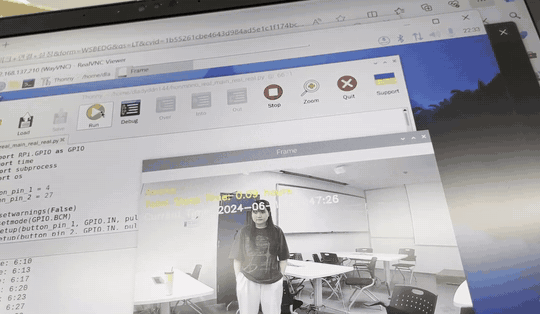
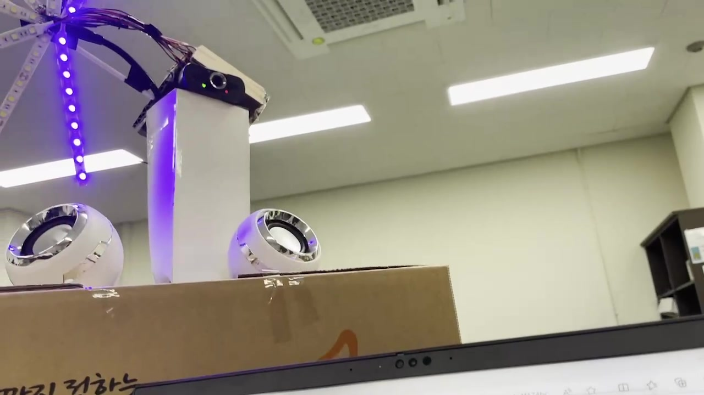
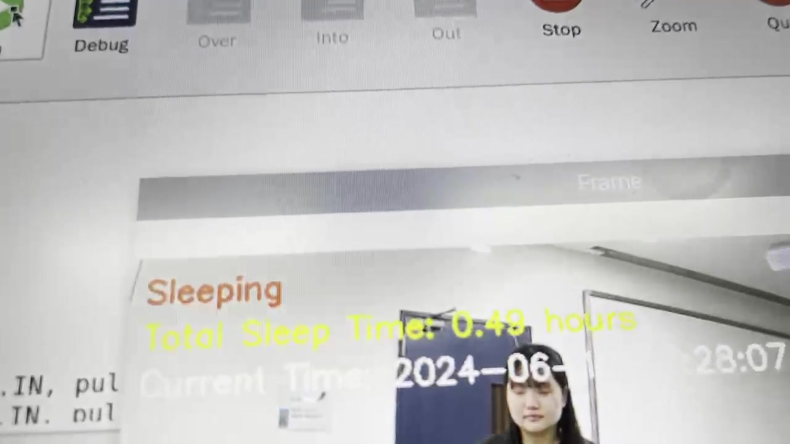
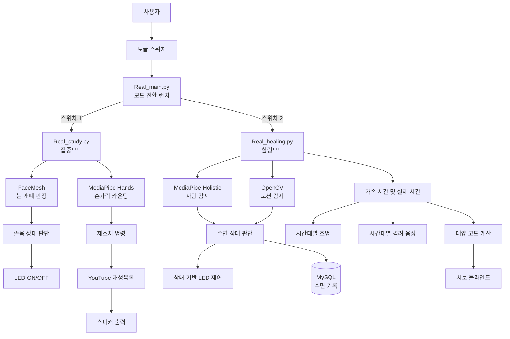

# 🌱 MindCare

> **Raspberry Pi와 MediaPipe를 활용한 1인 가구 마음챙김 웰니스 IoT 시스템**
> 사용자의 얼굴·손동작·움직임을 인식해 조명, 사운드, 수면 기록을 제어합니다.

<p>
  
  
  
  
  
</p>

**Team solobeam · 임용우 · 이어진 · 유민아**
**AI융합 로봇 S/W · 3인 팀 프로젝트**

---

## 🎬 핵심 시연

|                                손 제스처 기반 음악 제어                               |                                    수면 상태 전환                                    |
| :-------------------------------------------------------------------------: | :----------------------------------------------------------------------------: |
|  |  |
|                       손가락 개수와 손 방향을 인식해 음악 명령을 실행합니다.                       |                사용자가 일정 시간 움직이지 않으면 `Awake`에서 `Sleeping`으로 전환합니다.               |

|                              시간대별 조명 제어                              |                                수면 시간 누적                                |
| :------------------------------------------------------------------: | :--------------------------------------------------------------------: |
|  |  |
|                 시간과 사용자 상태에 따라 LED 색상과 점등 여부를 제어합니다.                 |                   감지한 수면 시간을 누적하여 화면에 표시하고 DB에 저장합니다.                  |

<p align="center">
  <a href="https://youtu.be/J4WTrTwApo0">
    <strong>▶ 전체 시연 영상 보기</strong>
  </a>
</p>

---

## 📌 프로젝트 배경

이 프로젝트는 **청년 우울 문제와 우울 상태에서 나타날 수 있는 집중력·인지능력 저하**에 대한 문제의식에서 출발했습니다.

특히 혼자 생활하는 사용자가 자신의 상태를 지속적으로 확인하기 어렵다는 점에 주목하여, 일상 속에서 자연스럽게 사용할 수 있는 조명·사운드·수면 기록 시스템을 기획했습니다.

MindCare는 의료 진단 장비가 아니라 다음 기능을 통해 사용자의 생활 리듬 관리를 보조하는 **웰니스 IoT 프로토타입**입니다.

* 집중 중 졸음 상태를 감지해 조명 제어
* 손동작만으로 백색소음과 명상음악 제어
* 시간대에 맞춘 조명과 격려 음성 제공
* 움직임을 기반으로 수면 상태 및 수면 시간 측정
* 날짜별 수면 데이터를 저장해 상담 시 참고자료로 활용

---

## 🎯 프로젝트 목표

1. **비접촉 사용자 상태 인식**
   카메라와 MediaPipe를 이용해 얼굴, 손, 자세 정보를 실시간으로 분석합니다.

2. **사용자 상태와 환경의 연동**
   인식 결과에 따라 LED, 스피커, 블라인드 등의 하드웨어를 제어합니다.

3. **집중·휴식 상황에 맞는 듀얼 모드 제공**
   물리 스위치로 집중모드와 힐링모드를 전환합니다.

4. **수면 데이터 기록 및 활용**
   수면 시작 시각, 종료 시각, 누적 수면 시간을 MySQL에 저장합니다.

---

## ⚙️ 모드별 주요 기능

### 🎯 집중모드

`src/Real_study.py`

집중모드는 사용자의 얼굴과 손을 인식하여 **졸음 상태와 음악 제어 명령**을 판단합니다.

| 기능      | 동작                                                   |
| ------- | ---------------------------------------------------- |
| 얼굴 인식   | MediaPipe FaceMesh로 얼굴과 눈 주변 랜드마크를 추적합니다.            |
| 눈 개폐 판정 | 눈 높이와 얼굴 높이의 비율을 계산해 `OPEN` 또는 `CLOSE`를 판단합니다.       |
| 졸음 감지   | 양쪽 눈이 5초 이상 닫히면 수면 상태로 판단합니다.                        |
| 조명 제어   | 졸음 상태이거나 얼굴이 일정 시간 감지되지 않으면 LED를 끕니다.                |
| 손가락 카운팅 | MediaPipe Hands로 펴진 손가락 개수를 계산합니다.                   |
| 음악 제어   | 손가락 개수에 따라 음악 정지·일시정지·재개·종료·목록 전환을 실행합니다.            |
| 음원 연동   | YouTube Data API로 재생목록을 불러오고 `mpv`와 `yt-dlp`로 재생합니다. |

#### 손가락 제스처 매핑

| 손가락 개수 | 실행 명령           |
| :----: | --------------- |
|   `0`  | 음악 정지           |
|   `1`  | 음악 일시정지         |
|   `2`  | 음악 재생 또는 재개     |
|   `3`  | 음악 정지 및 프로그램 종료 |
|   `4`  | 플레이리스트 전환       |

동일한 손동작이 **2초 이상 유지된 경우에만** 명령을 실행하도록 하여 순간적인 오인식에 의한 반복 명령을 줄였습니다.

---

### 🌙 힐링모드

`src/Real_healing.py`

힐링모드는 시간과 사용자의 움직임을 기반으로 **조명·격려 음성·수면 기록·블라인드**를 제어합니다.

| 기능        | 동작                                              |
| --------- | ----------------------------------------------- |
| 사람 감지     | MediaPipe Holistic의 자세 랜드마크로 사람의 존재 여부를 판단합니다.  |
| 모션 감지     | 배경 프레임과 현재 프레임의 차이를 OpenCV로 분석합니다.              |
| 수면 판단     | 사람이 감지된 상태에서 일정 시간 움직임이 없으면 `Sleeping`으로 전환합니다. |
| 수면 시간 측정  | 수면 시작·종료 시각과 누적 수면 시간을 계산합니다.                   |
| 수면 데이터 저장 | 날짜별 수면 기록을 MySQL `sleep_log` 테이블에 저장합니다.        |
| 시간대별 조명   | 오전·오후·저녁에 따라 파랑·흰색·주황 LED를 제어합니다.               |
| 격려 음성     | 아침·점심·저녁 시간대에 맞는 음성을 무작위로 재생합니다.                |
| 자동 블라인드   | `ephem`으로 계산한 태양 고도를 서보모터 각도에 반영합니다.            |

#### 시간대별 조명

|      시간     | LED |
| :---------: | --- |
| 09:00~11:59 | 파란색 |
| 12:00~17:59 | 흰색  |
| 18:00~22:59 | 주황색 |
|    그 외 시간   | OFF |

사람이 감지되지 않거나 수면 상태로 판단된 경우에는 시간대와 관계없이 조명을 끕니다.

---

## 🧩 전체 시스템 구조

물리 스위치 입력을 감지하는 `Real_main.py`가 현재 실행 중인 프로세스를 종료하고 선택된 모드의 스크립트를 실행합니다.



---

## ⏱️ 시연 환경

실제 하루의 기능을 짧은 발표 시간 안에 확인하기 위해 프로그램 내부 시간을 가속했습니다.

* **24시간을 약 30분으로 축약**
* 가속 배율: `288배`
* 시간대에 따른 LED와 음성 재생을 짧은 시간 안에 확인
* 수면 상태가 감지되면 `Total Sleep Time` 누적
* 프로그램상 **오후 4시**에 수면 데이터를 DB로 업로드

> 시간 가속은 발표 및 기능 검증을 위한 시연 설정이며, 실제 사용 환경에서는 배율을 조정하거나 실제 시간을 사용할 수 있습니다.

---

## 🛠️ 하드웨어 구성


| 부품             | 주요 사양               | 역할                  |
| -------------- | ------------------- | ------------------- |
| Raspberry Pi   | GPIO 및 Python 실행 환경 | 센서 처리와 전체 시스템 제어    |
| 브레드보드          | 회로 연결               | LED·스위치·서보 연결       |
| USB 카메라        | 실시간 영상 입력           | 얼굴·손·자세·움직임 인식      |
| LED 스트립        | 12V, 흰색·파란색·주황색     | 집중 상태와 시간대별 조명      |
| PC 스피커         | USB 전원, 3.5mm 입력    | 백색소음·명상음악·격려 음성 출력  |
| MG996R 서보모터 ×2 | 4.8~7.2V            | 블라인드 각도 제어          |
| 토글 스위치 ×2      | GPIO 입력             | 집중모드와 힐링모드 선택       |
| AA 배터리 ×8 및 홀더 | 1.5V × 8            | 12V LED 전원 공급       |
| 나무 원목 상자       | 하드웨어 수납             | Raspberry Pi와 회로 정리 |

|                                 내부 회로                                |                             LED 배열                             |
| :------------------------------------------------------------------: | :------------------------------------------------------------: |
|  |  |

---

## 💻 소프트웨어 구성

| 기술                 | 사용 목적                     |
| ------------------ | ------------------------- |
| Python             | 전체 제어 프로그램 작성             |
| OpenCV             | 영상 입력, 전처리, 프레임 차분, 화면 출력 |
| MediaPipe FaceMesh | 얼굴 및 눈 주변 랜드마크 추적         |
| MediaPipe Hands    | 손 랜드마크와 손가락 개수 분석         |
| MediaPipe Holistic | 사람의 자세 랜드마크 감지            |
| RPi.GPIO           | 스위치, LED, 서보모터 제어         |
| MySQL / PyMySQL    | 음원 경로 및 수면 데이터 저장         |
| YouTube Data API   | 백색소음·명상음악 재생목록 조회         |
| mpv / yt-dlp       | YouTube 음원 스트리밍           |
| pygame             | 로컬 격려 음성 파일 재생            |
| ephem              | 태양 고도 계산                  |
| threading          | 비전 및 음악 제어 스레드 실행         |
| subprocess         | 모드별 Python 스크립트 실행 및 종료   |

---

## 👨‍💻 담당 파트 — 컴퓨터 비전 파이프라인

**담당: 임용우**

팀 프로젝트에서 카메라 기반 사용자 인식 기능을 담당했습니다.

* FaceMesh 기반 눈 개폐 판정
* 눈을 감은 시간에 따른 졸음 감지
* MediaPipe Hands 기반 손가락 개수 계산
* 손 방향을 고려한 엄지 판정
* 제스처 유지 시간을 이용한 음악 명령 안정화
* 프레임 차분과 컨투어 기반 모션 감지
* 사람 감지와 움직임 정보를 결합한 수면 상태 판단

---

## 🔍 핵심 알고리즘

### 1. 눈 높이 정규화를 이용한 개폐 판정

카메라와 사용자 사이의 거리에 따라 눈 영역의 픽셀 크기가 달라지므로, 절대 높이 대신 **눈 높이와 얼굴 전체 높이의 비율**을 사용했습니다.

```python
_, eye_height, _ = getSize(image, face_landmarks, eye_indexes)
_, face_height, _ = getSize(
    image,
    face_landmarks,
    mp_face_mesh.FACEMESH_FACE_OVAL,
)

eye_ratio = (eye_height / face_height) * 90
eye_status = "OPEN" if eye_ratio > threshold else "CLOSE"
```

양쪽 눈이 모두 닫힌 상태가 5초 이상 지속되면 졸음으로 판단합니다.

---

### 2. 손가락 개수 계산

검지부터 새끼손가락까지는 손끝 랜드마크가 아래쪽 관절보다 위에 있는지를 비교합니다.

```python
finger_tips = [8, 12, 16, 20]

for tip in finger_tips:
    if hand_landmarks.landmark[tip].y < hand_landmarks.landmark[tip - 2].y:
        fingers_open += 1
```

엄지는 손바닥 방향과 왼손·오른손 여부에 따라 x좌표 비교 조건을 다르게 적용합니다.

---

### 3. 제스처 명령 안정화

손가락 개수가 한 프레임에서 잠깐 잘못 인식되더라도 바로 명령이 실행되지 않도록, 같은 상태가 일정 시간 유지되는지 확인합니다.

```python
if fingers_open != finger_state:
    finger_state = fingers_open
    finger_state_start_time = time.time()
elif time.time() - finger_state_start_time > DELAY_TIME:
    control_music(fingers_open)
```

---

### 4. 프레임 차분 기반 모션 감지

현재 프레임을 그레이스케일로 변환하고 Gaussian Blur를 적용한 뒤, 배경 프레임과의 절대 차이를 계산합니다.

```python
gray = cv2.cvtColor(frame, cv2.COLOR_BGR2GRAY)
gray = cv2.GaussianBlur(gray, (21, 21), 0)

frame_delta = cv2.absdiff(background, gray)
thresh = cv2.threshold(
    frame_delta,
    threshold,
    255,
    cv2.THRESH_BINARY,
)[1]

thresh = cv2.dilate(thresh, None, iterations=2)
```

이후 일정 면적 이상의 컨투어가 존재하면 움직임이 감지된 것으로 판단합니다.

```python
for contour in contours:
    if cv2.contourArea(contour) > 500:
        motion_detected = True
```

---

## 🗄️ 데이터베이스

`DB/schema.sql`에는 두 개의 데이터베이스 구성이 포함되어 있습니다.

### 수면 기록

```text
mydb
└── sleep_log
    ├── id
    ├── date
    ├── sleep_start
    ├── sleep_end
    └── total_sleep
```

### 음원 경로

```text
mp3files
└── files
    ├── id
    └── filepath
```

수면 데이터는 날짜, 수면 시작 시각, 수면 종료 시각, 누적 수면 시간 단위로 저장합니다.

---

## 🗂️ 저장소 구조

```text
mindcare/
├── src/
│   ├── Real_main.py       # GPIO 스위치 기반 모드 전환
│   ├── Real_study.py      # 얼굴·손 인식 기반 집중모드
│   └── Real_healing.py    # 조명·음성·수면 추적 기반 힐링모드
├── DB/
│   └── schema.sql         # 수면 로그 및 음원 파일 DB 스키마
├── docs/
│   ├── images/
│   │   ├── demo_thumbnail.jpg
│   │   ├── device_full.jpg
│   │   ├── internal_circuit.jpg
│   │   └── led_array.jpg
│   └── demo/
│       ├── gesture_recognition.gif
│       ├── sleep_state_transition.gif
│       ├── hardware_lighting.jpg
│       ├── gesture_recognition.jpg
│       ├── sleep_tracking.jpg
│       └── mood_lighting.jpg
└── README.md
```

---

## 🔧 실행 전 설정

이 저장소의 코드는 프로젝트 당시 Raspberry Pi 환경을 기준으로 작성되었으며, 일부 코드는 발표자료를 바탕으로 정리한 형태입니다. 실행 전 다음 값을 실제 환경에 맞게 수정해야 합니다.

### 1. 모드별 스크립트 경로

`src/Real_main.py`

```python
focus_script = "/절대/경로/mindcare/src/Real_study.py"
healing_script = "/절대/경로/mindcare/src/Real_healing.py"
```

Linux는 파일명의 대소문자를 구분하므로 `Real_study.py` 이름을 정확히 맞춰야 합니다.

### 2. YouTube API 및 재생목록

`src/Real_study.py`

```python
API_KEY = "YOUR_API_KEY"
playlist_id = "YOUR_PLAYLIST_ID"
playlist_id2 = "YOUR_PLAYLIST_ID2"
```

API 키는 코드에 직접 저장하지 않고 환경변수나 별도 설정 파일로 관리하는 것을 권장합니다.

### 3. MySQL 접속 정보

`src/Real_healing.py`

```python
DB_HOST = "localhost"
DB_USER = "root"
DB_PASSWORD = "YOUR_DB_PASSWORD"
DB_NAME = "mp3files"
```

DB 비밀번호 역시 GitHub에 커밋하지 않도록 주의해야 합니다.

### 4. 데이터베이스 생성

```bash
mysql -u root -p < DB/schema.sql
```

`mp3files.files` 테이블에는 실제 음원 파일의 경로를 추가해야 합니다.

### 5. 하드웨어 환경 확인

* GPIO 핀 번호
* USB 카메라 장치 번호
* LED 출력 핀
* 서보모터 PWM 범위
* 스피커 장치와 음원 경로
* 태양 고도 계산에 사용할 위도·경도
* Raspberry Pi의 전원 및 외부 12V LED 전원

---

## 🧪 적용한 안정화 방법

### 얼굴 크기 변화 대응

눈 높이 자체가 아닌 얼굴 높이에 대한 비율을 사용하여 카메라 거리 변화의 영향을 줄였습니다.

### 제스처 오입력 방지

같은 손가락 개수가 일정 시간 유지된 경우에만 음악 명령을 실행했습니다.

### 영상 노이즈 감소

모션 감지 전에 그레이스케일 변환과 Gaussian Blur를 적용했습니다.

### 작은 변화 제거

컨투어 면적이 기준값보다 큰 경우에만 실제 움직임으로 판단했습니다.

---

## 📊 시연을 통해 확인한 동작

* 스위치 입력에 따른 집중모드·힐링모드 전환
* 손 랜드마크와 손가락 개수 표시
* 손가락 개수에 따른 음악 제어 명령
* 사용자 상태에 따른 LED ON/OFF
* 시간대에 따른 LED 색상 변경
* 사람 감지 및 `Awake` 상태 표시
* 부동자세 지속 시 `Sleeping` 상태 전환
* 누적 수면 시간 표시
* 시간대별 격려 음성 재생
* 수면 데이터의 MySQL 저장

> 본 프로젝트에서는 분류 정확도나 에너지 절감량을 정량적으로 측정하지 않았으므로, README에는 구현 및 기능 검증 결과를 중심으로 정리했습니다.

---

## 🚀 향후 개선 방향

* 눈 개폐 및 모션 감지 성능을 정량적으로 평가할 테스트 데이터 구축
* 조도와 사용자별 차이에 따라 임계값을 자동 보정하는 기능 추가
* 손 제스처에 이동평균 또는 상태 머신을 적용해 안정성 향상
* API 키와 DB 정보를 `.env` 또는 별도 설정 모듈로 분리
* `requirements.txt`와 설치 스크립트 추가
* 수면 기록을 그래프로 확인하는 웹 대시보드 구현
* 상담자 계정 인증 및 수면 데이터 접근 권한 관리
* 실제 전력 측정을 통한 조명 에너지 절감 효과 분석
* 카메라 영상은 저장하지 않고 필요한 상태 정보만 처리하도록 개인정보 보호 강화

---

## 🎥 전체 시연 영상

버튼을 통한 모드 전환, 손 제스처 인식, 수면 상태 판정, 시간대별 조명과 음성 동작을 영상에서 확인할 수 있습니다.

[](https://youtu.be/J4WTrTwApo0)

---

## 📝 프로젝트 정보

| 항목     | 내용                                     |
| ------ | -------------------------------------- |
| 프로젝트명  | 1인 가구 마음챙김                             |
| 영문명    | MindCare                               |
| 팀명     | solobeam                               |
| 팀원     | 임용우, 이어진, 유민아                          |
| 개발 형태  | 3인 팀 프로젝트                              |
| 담당 파트  | 컴퓨터 비전 파이프라인                           |
| 주요 플랫폼 | Raspberry Pi                           |
| 주요 기술  | Python, OpenCV, MediaPipe, MySQL, GPIO |
